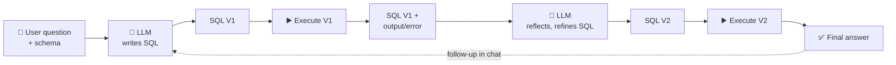

# 🔍 QueryLens — Your AI SQL Agent

[](https://img.shields.io/badge/Python-3.11-blue) [](https://img.shields.io/badge/Streamlit-app-ff4b4b) [](https://img.shields.io/badge/LLM-GPT--4.1-412991) [](https://img.shields.io/badge/license-MIT-green)

QueryLens is a small AI agent that turns a plain-language question and a database into what a data analyst would actually hand back: **a working SQL query and its result** — not just a first guess at the SQL.

It's a working prototype built to explore the **reflection pattern** in agentic systems: rather than generating a query once, the agent looks at what its first draft *actually returned* when run against the real database, critiques it, and produces an improved version — with the person able to keep chatting to iterate or ask something new.

> 📌 This is a portfolio / proof-of-concept project, not a production app.

---

## Table of Contents

- [Demo](#demo)
- [Why this project](#why-this-project)
- [How it works](#how-it-works)
- [Key features](#key-features)
- [Skills demonstrated](#skills-demonstrated)
- [Tech stack](#tech-stack)
- [Project structure](#project-structure)
- [Running it locally](#running-it-locally)
- [Known limitations](#known-limitations)
- [What's next](#whats-next)
- [Author](#author)

---

## Demo


The screenshot above is real app output: an actual sign-convention bug this project hit during development, kept in as the demo because it's a good illustration of what the reflection step is *for* — V1 sums a signed column without correcting for it, ranks backwards, and returns a negative number; the reflection step catches that (the query ran fine, but a negative "units sold" is a sign of a bug, not a valid answer), and V2 returns the correct ranking.

---

## Why This Project

The goal is to build a virtual SQL/data agent named QueryLens that works like a human analyst handed an ad-hoc question:

1. Draft a query quickly
2. Actually run it and look at the real output critically — not just re-read the code
3. Improve it if the output doesn't hold up
4. Hand back a working answer
5. Take a follow-up and iterate further if it's not quite right

That loop — "**draft → execute → self-critique → refine → iterate**" — is the core design idea behind this project, and the reason it's structured as an *agent* rather than a single prompt.

---

## How It Works



1. **Write** — the model receives the question and the database schema, and drafts a SQL query (V1).
2. **Execute (V1)** — that query runs immediately against the real database, producing a first-draft result (or an error).
3. **Reflect** — a second call looks at the *actual output or error* alongside the original question, sanity-checks it (a negative count or an inverted ranking is treated as wrong even if the query ran without error), and writes feedback plus an improved query.
4. **Execute (V2)** — the refined query runs, producing the final answer.
5. **Iterate (optional)** — the person can keep chatting ("now break that down by month"), which feeds the previous question and SQL back in as context for another round.

---

## Key Features

- 🧾 **SQL generation + self-critique** — writes a first-draft query, then reviews its own real output (not just the code) and refines it.
- 🩺 **Built-in sanity checks** — the reflection step is explicitly prompted to catch sign/aggregation errors (e.g. a "most sold" query resolving to a negative number) rather than treat "the query ran without error" as "the query is correct."
- 💬 **Chat-based iteration** — follow-up questions carry the previous question and SQL as context, so "now group that by month" and a brand-new question both work in the same thread.
- 🗄️ **Self-contained sample data** — generates a small event-sourced transactions database on demand, or accepts an uploaded SQLite file, so the app is usable immediately with no setup.
- 🧠 **Transparent, step-by-step workflow** — schema, V1, V1 output, reflection, and V2 are shown as separate steps rather than hidden behind one collapsed tab, plus a diagram inside the app itself explaining the pattern to a non-technical viewer.

---

## Skills Demonstrated

- **Agentic design patterns** — implementing a generate → execute → reflect → refine loop, including feeding real execution output/errors back into the LLM rather than relying on single-shot generation.
- **LLM application development** — prompt design for structured (JSON) outputs, and defensively parsing model responses (handling markdown-fenced JSON and malformed output) instead of assuming a well-formed reply.
- **Debugging & root-cause analysis** — diagnosed a subtle data bug (a signed delta column silently inverting a ranking query) by reproducing it against real data, then found and fixed a second, compounding bug where fragile JSON parsing was silently discarding the model's own proposed fix.
- **Full-stack prototyping** — an interactive Streamlit front end (chat interface, session state, file upload, sidebar configuration) built on top of a UI-agnostic agent module.
- **Provider abstraction** — using [aisuite](https://github.com/andrewyng/aisuite) to keep the agent logic provider-agnostic (`"openai:gpt-4.1-mini"`-style model strings) instead of hardcoding a single vendor's SDK.

---

## Tech Stack

| Layer   | Choice                                 |
| ------- | --------------------------------------- |
| UI      | [Streamlit](https://streamlit.io/)      |
| LLM     | OpenAI GPT-4.1 / GPT-4.1-mini (via [aisuite](https://github.com/andrewyng/aisuite)) |
| Data    | pandas, sqlite3                         |
| Secrets | python-dotenv                           |

---

## Project Structure

```
.
├── SQL_agent_app.py   # Streamlit UI (QueryLens) — layout, chat, session state
├── SQL_agent.py        # Agent logic — SQL generation, self-critique/refinement
├── utils.py            # Shared helpers — schema/query execution, sample data generation
├── assets/
│   ├── logo.png         # auto-generated on first run if missing
│   └── demo.png
├── requirements.txt
├── .gitignore
└── README.md
```

Clean separation on purpose: `SQL_agent.py` has no Streamlit imports at all — the agent logic is fully decoupled from the UI, so it could just as easily be driven from a CLI, a notebook, or a different frontend.

---

## Running It Locally

```
git clone https://github.com/<your-username>/<your-repo-name>.git
cd <your-repo-name>

conda create -n querylens-agent python=3.11
conda activate querylens-agent
pip install -r requirements.txt
```

Create a `.env` file in the project root with your OpenAI API key:

```
OPENAI_API_KEY=sk-your-key-here
```

Then run:

```
streamlit run SQL_agent_app.py
```

The app opens automatically at `http://localhost:8501`. On first launch it draws its own logo into `assets/logo.png` and can generate a sample transactions database from the sidebar — no extra setup needed.

---

## Known Limitations

- **Single-table focus** — `utils.get_schema` currently targets one hardcoded `transactions` table; arbitrary multi-table schemas would need more general schema introspection.
- **No sandboxing** — SQL runs directly against the local SQLite file, which is fine for a local/portfolio demo but not for untrusted multi-user deployment.
- **Reflection isn't a guarantee** — the refinement step is prompted to sanity-check signed/aggregation results, but it's still a single LLM pass and can miss subtler correctness issues.
- **Shallow conversation memory** — follow-up context carries only the immediately previous turn's question and SQL, not the full chat history.
- **No automated test suite yet** — correctness has been spot-checked manually against the sample database rather than covered by tests.

---

## What's Next

- Sandbox/limit SQL execution (read-only connection, statement allowlist, timeouts) for safer multi-user use
- Generalize `utils.get_schema` to introspect any table(s) in an uploaded database, not just `transactions`
- Add automated tests around `generate_sql` / `refine_sql_external_feedback` (mocking the LLM client) to guard against regressions like the sign-convention bug this project already caught and fixed
- Carry fuller conversation history into follow-up context instead of just the last turn
- Support SQL dialects beyond SQLite

---

## Author

Built by **Amir** as a hands-on exploration of agentic design patterns (reflection, self-correction) and LLM application development.
